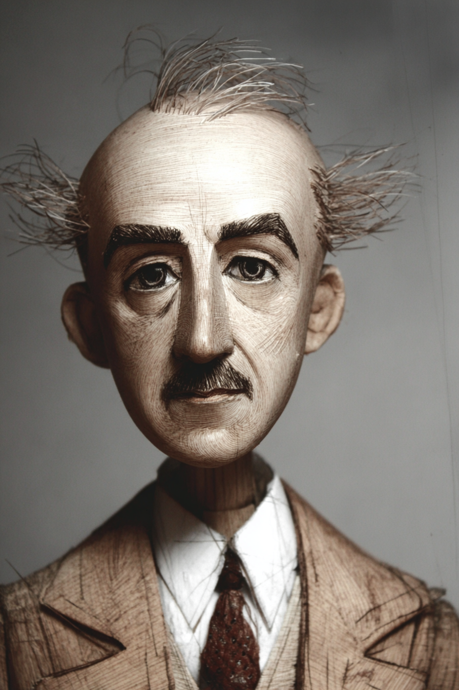

# Chapter 10 — Monopolistic Competition and Oligopoly

*The territory between perfect competition and pure monopoly — and the strategic games that fill it.*

Between 1997 and 2004, executives from four companies — Procter & Gamble, Henkel, Unilever, and Colgate-Palmolive — met in small Paris cafés. Together their firms controlled about 90 percent of the French laundry detergent market. The meetings had one purpose: agree on prices, divide the territory, stop competing.

This kind of arrangement is called a **cartel**, and it's illegal in most countries because it produces monopoly outcomes — high prices, restricted output — without the structural justification of a single dominant firm. French regulators eventually caught the detergent companies and fined them €361 million in 2011. The conspirators couldn't really argue innocence; the volumes of café meetings and written notes made the conspiracy clear.

Why did they do it? Because in markets with a small number of large firms, competing aggressively means earning very little, and *not* competing aggressively means earning a lot. Each firm's payoff depends on what the others do. The temptation to coordinate is enormous. The temptation to defect from that coordination is also enormous. The whole structure becomes a game.

This chapter is about the territory between Chapters 8 and 9. Most real markets don't look like the wheat farmer's perfect competition or a monopoly with no rivals. They look more like restaurants, smartphones, breakfast cereal, gas stations, beer brands — markets with either many firms producing slightly different products, or a few firms locked in strategic calculation. Both structures are common. Both behave in ways the simple models from previous chapters don't fully predict.

---

## Many Firms, Differentiated Products

Walk into any reasonably sized American city and count the restaurants. There are over 600,000 in the United States. Each one is slightly different from the others — different cuisine, different ambiance, different location, different chef, different price point. None of them have significant pricing power over the others. If a Korean BBQ place raises its prices substantially, customers will eventually drift away. But raising prices a small amount won't empty the dining room overnight, because the substitutes aren't perfect — your usual place has its specific wings, its specific side dishes, its specific Tuesday-night atmosphere.

This is **monopolistic competition**: many firms, differentiated products, free entry and exit. The firm has some pricing power — a tiny mini-monopoly on its particular variety. But because there are many close substitutes, its demand curve is much flatter than a true monopolist's. Raise the price a little, lose some customers. Raise it a lot, lose nearly all of them.

The profit-maximization rule is the same as in Chapter 9: produce where MR = MC, then charge the price the demand curve supports at that quantity. In the short run, this can produce positive economic profit (attractive product, good location) or losses (bad location, weak menu).

<!-- → [CHART: Monopolistic competition short-run outcomes — two side-by-side firm diagrams, both with downward-sloping demand, MR curve, MC curve, and ATC curve. Left: price above ATC at MR = MC quantity — profit rectangle shaded. Right: price below ATC at MR = MC quantity — loss rectangle shaded. Caption: "Short-run profit or loss depends on whether demand is strong enough to push price above ATC. Either way, MR = MC gives the right quantity. The short-run loss doesn't mean exit yet — it means no new entrants and some potential for existing firms to leave."] -->

Then free entry does its work. Positive economic profits attract new entrants offering similar-but-different products. Each new entrant takes some customers from the existing firms — existing firms' demand curves shift left and become flatter. Entry continues until economic profit is competed down to zero. The same long-run attractor as perfect competition.

But here's the critical difference. Under perfect competition, the long-run equilibrium has each firm producing at the bottom of its long-run average cost curve — full productive efficiency. Under monopolistic competition, the long-run equilibrium has each firm producing *to the left of* the bottom of its cost curve. The downward-sloping demand line is tangent to the average cost curve at a point where average cost is still falling.

<!-- → [CHART: Monopolistic competition long-run equilibrium — firm-level diagram with downward-sloping demand curve, MR curve, and U-shaped LRAC curve. Demand curve tangent to LRAC at a point to the LEFT of the minimum. MR = MC at a lower quantity. Mark: quantity produced Q_mc less than the efficient quantity Q*. Caption: "At long-run zero-profit equilibrium, the monopolistic competitor produces to the left of minimum LRAC. Excess capacity is the geometric signature of differentiation — there are more firms, each running below efficient scale."] -->

The consequence: monopolistic competitors operate at less than fully efficient scale. There are too many firms, each producing too little, each with average cost higher than the minimum possible. The market trades efficiency for variety. The world has lots of restaurants instead of one big efficient food factory.

Whether that trade-off is worth it is a values question the model cannot answer. Variety has real value; efficiency has real value. The model tells you what each costs. It doesn't tell you which to prefer.

---

## Advertising as Differentiation Engine

Monopolistic competition is the natural home of advertising, because advertising is what *creates* and *maintains* the differentiation that makes the mini-monopoly possible.

The shampoo aisle is the clearest case. Most shampoos are chemically very similar. The differentiation lives almost entirely in branding, packaging, advertising, and the perceptions those create. From the firm's perspective, advertising shifts the demand curve right and makes it less elastic — both effects raise profit. From the consumer's perspective, advertising sometimes provides information, often creates wants, and always adds to the product's cost (the advertising budget is rolled into the price).

From society's perspective, the question is contested. Some economists see advertising as a genuine information service that reduces consumer search costs — I know Tide works on grass stains because I've seen the demonstration. Others see it as a wasteful arms race between firms competing for the same pool of buyers — if Coke and Pepsi both advertise at each other indefinitely, neither gains market share but both bear the cost, which consumers ultimately pay. Both views capture something real.

One empirical regularity is hard to ignore. Advertising-intensive industries — consumer packaged goods, beer, cigarettes, perfume — consistently show higher prices and slightly higher profit margins than non-advertised equivalents. Generic shampoo with similar chemistry is much cheaper than the branded version. The branded shampoo's advertising is doing real work for its maker. Whether it's doing real work for the buyer is a separate question that varies by product and by buyer.

<!-- → [TABLE: Advertising — two views. Two-column table. Column 1: Information View (advertising as useful). Column 2: Arms-Race View (advertising as wasteful). Rows: What advertising does / Who benefits / The evidence for this view / Real-world example / Policy implication. Caption: "Both views are right about some products. The distinction matters for policy: if advertising is mostly informative, restricting it harms consumers; if it's mostly a zero-sum arms race, restricting it might reduce prices without reducing welfare."] -->

---

## Few Firms, Strategic Interaction

Now the smaller-numbers case.

An **oligopoly** is a market dominated by a small number of large firms — typically two to roughly ten. The examples are everywhere: U.S. commercial airlines (about four major carriers), wireless carriers (three), automobile manufacturers (a half-dozen globally significant), smartphone operating systems (Apple iOS and Google Android with marginal others), credit card networks (Visa and Mastercard plus smaller players).

What makes oligopoly distinct from everything we've analyzed before is **mutual interdependence**. Each firm's optimal decision depends on what the other firms do — and each firm knows it. A wheat farmer doesn't think about how her individual planting decisions affect anyone else; her impact is too small. The CEO of Delta absolutely thinks about how Delta's pricing on the JFK-LAX route affects American Airlines' response, because American can react and probably will.

This is a fundamentally different analytical situation. In the models of Chapters 8 and 9, a firm could calculate its optimal action without modeling the behavior of rivals. In oligopoly, that's not possible. The firm's best action depends on a prediction of what others will do, which depends on their prediction of what you'll do, which depends on your prediction of their prediction, and so on. The mathematics of this situation is game theory, and we only need one piece of it: the prisoner's dilemma.

---

## The Prisoner's Dilemma

The classic setup: two suspects are arrested for a crime. Police question them separately. Each is offered a deal — confess and turn in your accomplice, get a lighter sentence. The payoff structure:

- If both stay silent: each gets 1 year in prison.
- If both confess: each gets 5 years.
- If one confesses and the other stays silent: the confessor goes free, the silent one gets 10 years.

Each prisoner reasons independently: "If my partner stays silent, I should confess — I go free instead of doing a year. If my partner confesses, I should still confess — I do five years instead of ten. Either way, I should confess."

Both confess. Both get five years. Even though both would have been better off if both had stayed silent.

The key structure here is the *dominant strategy*: confess is the right choice regardless of what the other player does. When both players have a dominant strategy that leads to a worse outcome than the cooperative alternative, you have a prisoner's dilemma.

Now apply this to oligopoly. Two firms — call them A and B — can each choose a high price or a low price.

<!-- → [TABLE: Prisoner's dilemma payoff matrix — oligopoly pricing. Two-by-two matrix. Rows: Firm A chooses High Price / Firm A chooses Low Price. Columns: Firm B chooses High Price / Firm B chooses Low Price. Cells: (High, High): A earns $50M, B earns $50M; (High, Low): A earns $10M, B earns $80M; (Low, High): A earns $80M, B earns $10M; (Low, Low): A earns $20M, B earns $20M. Caption: "The cooperative outcome ($50M each) requires both firms to charge high. But each firm's dominant strategy is to charge low — $80M beats $50M if the other cooperates; $20M beats $10M if the other defects. Individual rationality produces collective failure."] -->

Each firm reasons: "If B charges high, I should charge low — $80 million beats $50 million. If B charges low, I should still charge low — $20 million beats $10 million. Either way, charge low." Both charge low. Both earn $20 million. The cooperative outcome — $50 million each — is visible and obviously better for both. But neither firm, acting individually, has an incentive to get there.

This is why the Paris café meetings happened. The detergent executives understood the game theory perfectly. They knew uncoordinated competition would drive them to the ($20M, $20M) cell, and that coordination would get them to ($50M, $50M). They tried to impose the cooperative outcome through explicit agreement. The meetings had to be secret and illegal precisely because the individual incentive to defect was always present — any member who quietly undercut the others could grab the $80 million corner.

---

## Why Cooperation Is Unstable

The prisoner's dilemma predicts cartels will collapse, and history largely confirms this.

Repetition helps sustain cooperation. When firms interact repeatedly rather than in a single game, the threat of future punishment makes defection less attractive. A tit-for-tat strategy — match whatever the other firm did last period — can support cooperation because defection today means punishment tomorrow. OPEC has maintained some coordination for decades partly because the members interact continuously and can observe each other's production levels.

Transparency helps detect defection quickly, but it's double-edged from society's perspective. If prices are publicly observable, secret price-cutting is caught fast and punished — which supports cartel stability. But price transparency in an oligopoly is also suspicious: industries that post prices on shared industry websites may be facilitating coordination that antitrust authorities should scrutinize.

Concentration helps. Two firms find it easier to coordinate than ten — each member's share of the gain is larger, and defection is more visible.

None of these mechanisms eliminate instability. Demand shocks, new entrants, cost structure changes, leadership transitions — all can destabilize cooperation. OPEC has broken down multiple times. Airline pricing coordination has waxed and waned for decades. Long-running stable cartels are the exception; intermittent, fragile cooperation punctuated by price wars is the norm.

<!-- → [TABLE: Conditions that help or hurt cartel stability — two-column table. Column 1: Makes cartel MORE stable. Column 2: Makes cartel LESS stable. Rows: Few members / Many members; Similar cost structures / Asymmetric costs; Prices publicly observable / Secret or opaque pricing; Repeated interaction / One-shot or infrequent interaction; Slow-growing market / Rapidly growing market (entry tempting); High entry barriers / Easy entry by outsiders; No government enforcement / Active antitrust surveillance. Caption: "OPEC has many stabilizing features (few members, observable production quotas, repeated interaction) and several destabilizing ones (member cost asymmetries, temptation to sell above quota). The table predicts why OPEC is more stable than most cartels but still breaks down periodically."] -->

---

## Why Oligopoly Is Hard to Model

The prisoner's dilemma gives the intuition. The precise prediction is harder, because different assumptions about how firms form expectations of each other produce genuinely different models.

The **Cournot model** assumes firms choose quantities and take each other's quantities as given. The equilibrium sits between perfect competition and monopoly: output is higher than monopoly, lower than competitive; prices are lower than monopoly, higher than competitive.

The **Bertrand model** assumes firms choose prices and take each other's prices as given. If the product is homogeneous, firms undercut each other until price equals marginal cost — the same outcome as perfect competition. Even two firms can be "competitive" in the Bertrand sense.

The **Stackelberg model** assumes one firm moves first (the *leader*) and the other responds optimally (the *follower*). The leader exploits its first-mover advantage to claim more market share.

<!-- → [TABLE: Oligopoly models compared. Four-column table. Columns: Model / Key assumption / Predicted output relative to monopoly / Predicted price relative to perfect competition. Rows: Perfect competition (benchmark) / Cournot (firms choose quantities simultaneously) / Bertrand — homogeneous products (firms choose prices simultaneously) / Stackelberg (sequential quantity moves) / Monopoly (benchmark). Caption: "Same market structure, three different models, three different predictions. Which applies depends on whether firms compete on price or quantity, move simultaneously or sequentially. The choice is empirical, not theoretical — and sometimes multiple models describe the same industry at different points in time."] -->

Real oligopolies sometimes look like one model, sometimes another. Airlines compete like Bertrand players on heavily contested routes; they behave more like Cournot players where one carrier dominates. The model gives a range — between competitive and monopoly outcomes — with the specific position depending on coordination success, entry barriers, and the nature of competition in that specific market.

---

## The Four Structures, Assembled

Pull back and look at where this chapter sits in the full map.

<!-- → [TABLE: Four market structures — rows: Perfect competition, Monopolistic competition, Oligopoly, Monopoly. Columns: Number of firms, Product type, Pricing power, Long-run economic profit, Efficiency outcome. Values: Perfect competition — many, identical, none, zero, productive + allocative efficiency; Monopolistic competition — many, differentiated, slight, zero (excess capacity), allocatively inefficient; Oligopoly — few, identical or differentiated, substantial, variable (depends on coordination), between competitive and monopoly; Monopoly — one, unique, full (limited by demand), positive, deadweight loss. Caption: "The four structures are a spectrum, not four isolated categories. Most real markets fall in the middle two rows. The extremes are textbook benchmarks."] -->

Most real markets are not perfect competition or pure monopoly. They are monopolistic competition — most local services, most consumer brands, most retail — or oligopoly — most major manufacturing industries, most telecommunications, most platforms and networks. Knowing which structure a market sits in tells you what to expect about prices, output, and the shape of competition.

<!-- → [TABLE: How to tell monopolistic competition from oligopoly — diagnostic checklist. Two-column table. Column 1: Looks like monopolistic competition. Column 2: Looks like oligopoly. Rows: Number of firms (many vs. few) / Market share of largest 4 firms (low vs. high) / Firm's awareness of rival decisions (indirect via market price vs. direct and named) / Strategic response to rival pricing (none — too small to matter vs. explicit — must model rival's reaction) / Advertising character (brand-building, variety-signaling vs. competitive arms race for share of fixed pie) / Real-world examples. Caption: "The distinction is not always sharp — a regional hospital market with 6 hospitals might be oligopoly; a city restaurant market with 600 restaurants is monopolistic competition. The test is whether any one firm's decisions visibly affect identifiable rivals."] -->

Two lessons recur. First, competition takes work to maintain. Free entry is the cleanest enforcement mechanism — it drives long-run profit to zero in monopolistic competition the same way it does in perfect competition. When entry is blocked, prices rise above competitive levels and stay there. Second, strategic behavior matters more as the number of firms shrinks. In a market with thousands of farmers, no individual planting decision matters. In a market with three wireless carriers, every pricing decision is a move in a game the others are watching.

The Paris café meetings tell the whole story in miniature. Four firms, 90 percent of the market, all of them facing the prisoner's dilemma. The cooperative equilibrium they tried to build was the monopoly outcome achieved through coordination rather than single-firm dominance. Catching them was the regulatory enforcement the model says is necessary: without it, oligopoly markets tend toward the profits-at-consumers'-expense outcome that antitrust law exists to prevent.

---

## LLM Exercises

**Exercise 1 — Classify the market.** Give an LLM a list of ten industries (smartphones, restaurants, wheat, electricity in your city, gasoline retail, breakfast cereal, social networks, beer, taxis in your town, online dating apps). Ask it to classify each as perfect competition, monopolistic competition, oligopoly, or monopoly, with a one-sentence justification. Push back on any classification you disagree with — the test is whether the LLM is reasoning from the four conditions or just pattern-matching.

**Exercise 2 — Why monopolistic competition has excess capacity.** Ask an LLM to explain in plain language why a monopolistic competitor in long-run equilibrium operates at less than its minimum-average-cost output. A good answer points to the downward-sloping demand curve being tangent to the falling portion of the LRAC curve. If the LLM can't get there, walk through it together.

**Exercise 3 — Build a prisoner's dilemma payoff matrix.** Tell an LLM to construct a payoff matrix for two firms — call them Coke and Pepsi — choosing between a high advertising budget and a low advertising budget. Have the LLM label the four cells with realistic profit numbers (you can supply or have it estimate). Then ask: which is the dominant strategy, and what's the equilibrium? Use this to internalize the dilemma logic.

**Exercise 4 — Why cartels collapse.** Ask an LLM why most cartels are unstable, even when they produce higher profits for all members. A good answer names the prisoner's-dilemma logic and points to the temptation of unilateral defection. Then push: what mechanisms have firms used to sustain cartels for longer periods (OPEC, the diamond cartel)? Evaluate which mechanisms the LLM identifies and which it misses.

**Exercise 5 — Diagnose advertising.** Pick a heavily advertised product category (e.g., razors, beer, perfume, breakfast cereal, athletic shoes). Ask an LLM to argue both sides: that advertising in this category provides genuine information value to consumers, and that advertising in this category is mostly a wasteful arms race between firms. Evaluate which argument is stronger for that specific product and why.

---

## LLM Exercise — Chapter 10: Monopolistic Competition and Oligopoly (Policy Brief Project)

**Project:** Policy Brief.
**What you're building this chapter:** the realistic-middle analysis — your industry probably isn't perfect competition or pure monopoly; it's monopolistic competition or oligopoly. The strategic-interaction layer matters here.
**Tool:** **Claude Project** "Policy Brief" — appends a section.

---

**The Prompt:**

```
Chapter 10 of my Policy Brief project. Prior sections in this Claude
Project. Chapter 10 taught: monopolistic competition (many firms,
differentiated products, free entry, each firm has SOME market
power because no one's product is a perfect substitute);
oligopoly (few firms, strategic interaction — each firm's
decisions depend on what rivals will do); the prisoner's dilemma
applied to oligopoly pricing; collusion (explicit and tacit) and
why it's unstable; game-theoretic equilibria.

Write the brief's "Strategic Behavior in the Affected Industry"
section in 300–500 words.

1. **Place the industry on the spectrum.** Monopolistic competition
   (lots of differentiated firms — restaurants, clothing, books)
   or oligopoly (handful of dominant firms — airlines, telecom,
   semiconductors)? Be specific about the criteria you used to
   place it.

2. **The strategic effect of the policy.** In an oligopoly,
   firms react to a policy not just by adjusting their own
   behavior but by anticipating rivals' adjustments. This produces
   second-order effects the simple D&S model misses. For a tax,
   firms might collude to maintain margins. For a regulation,
   firms might race to comply (or to lobby for grandfathering).
   Predict the strategic response in your industry.

3. **The collusion question.** Many industry-specific policies
   inadvertently make collusion easier or harder. A standardized
   reporting requirement makes prices more visible (easier
   collusion). An antitrust action makes coordination riskier
   (harder collusion). A price ceiling becomes a focal point
   (easier coordination). Name how your policy affects collusion
   risk.

End with one sentence on which is more important for your policy:
the consumer-side effect (covered in Ch 6) or the producer-side
strategic effect (covered here). For most policies the answer
isn't obvious; the brief should name it.
```

---

**What this produces:** A 300–500 word section on the strategic / oligopoly effects. Most policy analyses skip this layer; the brief gets sharper for including it.

**How to adapt this prompt:**

- *For your own project:* Antitrust students: this chapter is central — the policy IS oligopoly intervention. Tariff students: trade barriers often produce oligopolistic structure in domestic markets that wouldn't exist with import competition.
- *For ChatGPT / Gemini:* Works as written.
- *For Claude Code:* If you want a payoff matrix for the strategic interaction, Claude Code can produce it.
- *For a Claude Project:* Append.

**Connection to previous chapters:** Ch 8 (perfect competition) and Ch 9 (monopoly) gave the benchmarks; Ch 10 names where the actual industry sits between them.

**Preview of next chapter:** Chapter 11 deepens the antitrust analysis — the legal toolkit, how concentration is measured, and the natural-monopoly regulation question. Critical if your policy IS antitrust; informative even if not.

---

## AI Wayback Machine



*Puppet Art by [Nik Bear Brown](https://www.nikbearbrown.com/).*

**Run this:**

```
Who is Edward Chamberlin, and how does their work connect to
monopolistic competition we covered in this chapter? Keep it to
three paragraphs. End with the single most surprising thing about
their career or ideas.
```

→ Search **"Edward Chamberlin"** on Wikipedia.

**Now make the prompt better.** Try one of these:

- Ask it to apply Edward Chamberlin's framework to a current economic question.
- Add a constraint: "Answer including criticisms or limits of Edward Chamberlin's framework."

What changes? What gets better? What gets worse?

---

*Byline: Nik Bear Brown.*
